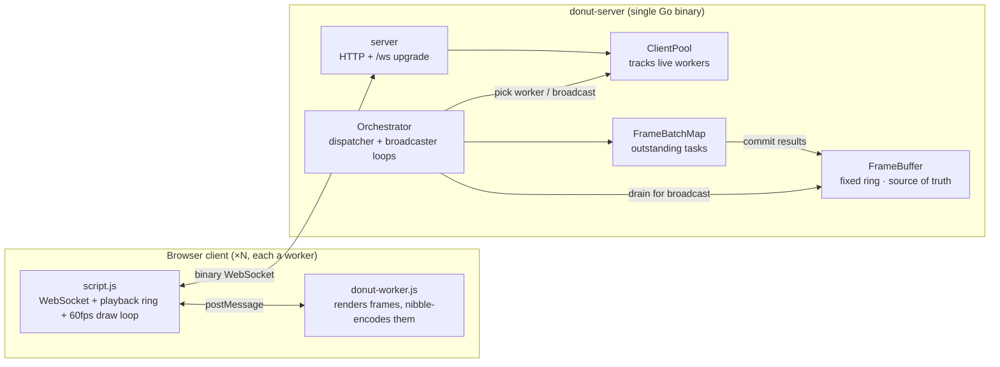
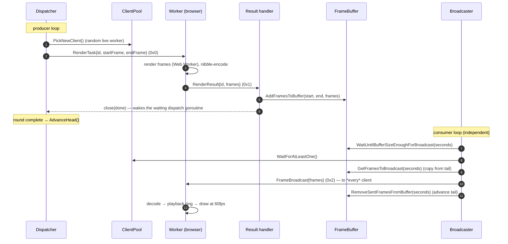
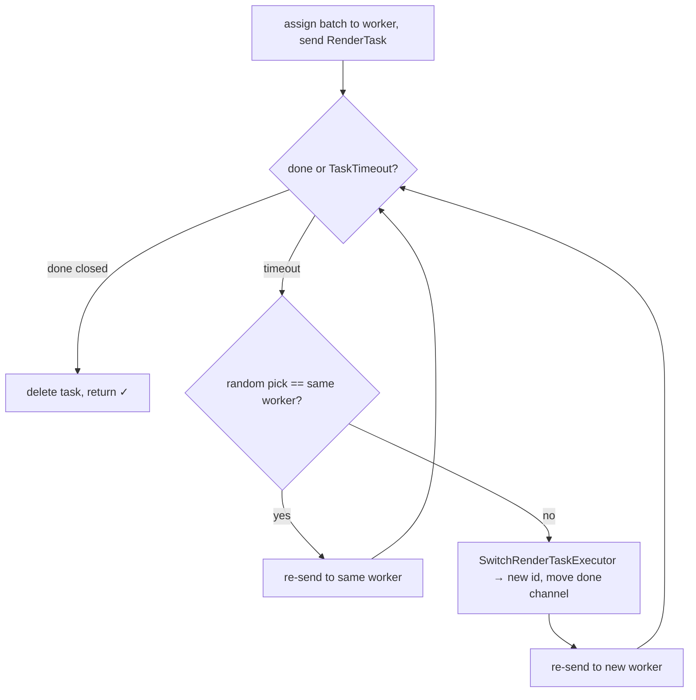

# Technical deep dive

> The deep dive. For a one-screen overview and how to run the project, see
> [`README.md`](README.md); for how performance is measured and how to read the
> numbers, see [`BENCHMARKS.md`](BENCHMARKS.md). This document explains how the
> system is built and, more importantly, **why it is built this way** — the data
> flow, each subsystem, the concurrency model, the failure handling, and the
> design decisions behind them.

## The central idea

Distributed Donut renders [a1k0n's spinning ASCII
donut](https://www.a1k0n.net/2011/07/20/donut-math.html) — but no server ever
draws a frame. The browsers that *watch* the animation are the same machines
that *compute* it. The Go server is a pure **orchestrator**: it never runs the
donut math. It hands out frame ranges, collects the rendered results, and
broadcasts the same stream of frames back to every connected browser.

This produces a self-feeding crowd: the more viewers, the more compute, the
faster the work clears. The engineering effort is therefore not in the donut
(~40 lines of trigonometry borrowed wholesale) but in the **coordination**:
keeping a steady 60fps stream flowing through an untrusted, churning fleet of
workers that can join, leave, or stall at any moment.

---

## Table of contents

1. [Context and goals](#1-context-and-goals)
2. [System at a glance](#2-system-at-a-glance)
3. [End-to-end data flow](#3-end-to-end-data-flow)
4. [The wire protocol](#4-the-wire-protocol)
5. [Subsystems](#5-subsystems)
6. [The frame buffer in depth](#6-the-frame-buffer-in-depth)
7. [Concurrency model](#7-concurrency-model)
8. [Fault tolerance](#8-fault-tolerance)
9. [Security posture](#9-security-posture)
10. [Configuration reference](#10-configuration-reference)
11. [Design decisions](#11-design-decisions)
12. [Known limitations and future work](#12-known-limitations-and-future-work)

---

## 1. Context and goals

**Where it came from.** This started as a way to learn how to build a *distributed system* the
hard way — low-level, from scratch, real-time, and easy to show off in a browser
tab. The genre inspiration is [eieio.games](https://eieio.games/): playful,
experimental, browser-based projects where something happening on one person's
client has a global effect on everyone else. Distributed Donut takes that shape —
your browser does real work, and the result feeds every other viewer — and points
it at a deliberately CPU-bound toy problem. It was equally a vehicle for going
deeper with Go and its concurrency model — goroutines, channels, condition
variables — which the [concurrency section](#7-concurrency-model) leans on
heavily.

**What the system actually does.** The shape of the system comes down to a few
facts that drive the decisions below:

- **The compute runs on the browsers; the infrastructure is hand-rolled.** No
  message broker, no job queue, no rendering framework — the orchestrator, the
  wire protocol, the ring buffer, and the scheduling are all written from scratch.
- **Frames are produced ahead of playback and streamed continuously.** The
  dispatcher keeps a rolling window of frames rendered *ahead* of where playback
  is; the broadcaster pushes them out as they're ready, so a browser receives a
  continuous stream rather than waiting on a batch job.
- **A browser becomes a worker just by opening the page** — no install, no
  sign-up.
- **Workers join and leave constantly.** They're browser tabs: they appear,
  close, throttle in the background, and run on everything from phones to
  workstations, so the pipeline treats worker loss as the normal case
  ([§8](#8-fault-tolerance)).

**One scoping point worth stating plainly:** the server guarantees synchronized
*dispatch*, not synchronized *playback*. It owns the single authoritative frame
timeline — it decides what frame N is and broadcasts the same bytes to everyone —
but it makes no promise that two browsers paint frame N at the same wall-clock
moment. What each client does with the stream is its own concern, subject to
network jitter, background-tab throttling, decode speed, and device performance.
True playback synchronization is a separate, much harder problem this project
deliberately does not attempt.

---

## 2. System at a glance

The system is two cooperating halves connected by one binary WebSocket protocol:



Structurally, the server runs **two independent loops** that meet only at the
[frame buffer](#6-the-frame-buffer-in-depth):

| Loop | Direction | Job | Paces against |
| --- | --- | --- | --- |
| **Dispatcher** (producer) | server → workers → buffer | Keep the buffer *full ahead* of playback by farming out render tasks and committing results. | Buffer fullness (backpressure) |
| **Broadcaster** (consumer) | buffer → all workers | Drain the buffer from the tail at real time and push frames to every client. | Wall-clock (`BroadcastInterval`) |

Neither loop calls the other. They are decoupled by the buffer, which is the
**single source of truth** for "which frames exist and are ready to play."

---

## 3. End-to-end data flow

A frame's life, from assignment to pixels. The dispatcher and broadcaster are
separate loops; the diagram shows how a single batch threads through both.



Walking it through:

1. **Connect.** The browser loads the embedded client, opens a WebSocket to
   `/ws`, and spawns a Web Worker. The server upgrades the connection, wraps it
   in a `Client`, adds it to the `ClientPool`, and starts that client's writer
   goroutine.
2. **Dispatch.** The dispatcher picks a random live worker and sends it a
   `RenderTask` naming a contiguous frame range (e.g. frames 120–179).
3. **Render.** In the browser, `script.js` forwards the task to its Web Worker,
   which runs the donut math off the UI thread, packs the result, and posts it
   back. `script.js` sends it to the server as a `RenderResult`.
4. **Commit.** The server's read loop decodes the result and hands it to the
   orchestrator's result handler, which writes the frames into the ring buffer
   and closes the task's `done` channel — unblocking the dispatch goroutine that
   was waiting on this exact batch.
5. **Advance.** Once every batch in the round is committed, the dispatcher
   advances the buffer head over the freshly written region.
6. **Broadcast.** Independently, the broadcaster waits until enough frames have
   accumulated, copies a slice from the tail, and sends it to **all** clients in
   one prepared (compressed-once) message, then advances the tail past them.
7. **Play.** Each browser decodes the broadcast into frame strings, pushes them
   into a local playback ring, and a `requestAnimationFrame` loop paints one
   frame every ~16.7 ms into a `<pre>` element.

---

## 4. The wire protocol

All traffic is **binary WebSocket** frames. Every message starts with a 1-byte
type tag. Multi-byte integers are **big-endian**. The format is defined in
[`internal/protocol`](internal/protocol/protocol.go) and mirrored by the JS
client.

### Message types

| Tag | Name | Direction | Layout (after tag byte) |
| --- | --- | --- | --- |
| `0x0` | `RenderTask` | server → worker | `id:u32` · `startFrame:u32` · `endFrame:u32` (12 bytes) |
| `0x1` | `RenderResult` | worker → server | `id:u32` · `frames:[BatchSize]byte` |
| `0x2` | `FrameBroadcast` | server → all workers | `frames:[]byte` (one or more batches) |

`id` is the **render task ID**, scoped per client (each `Client` hands out its
own monotonically increasing IDs). It lets the server match a returning result
to the batch it assigned, even after a task has been reassigned (the new
executor gets a fresh ID — see [§8](#8-fault-tolerance)).

### Frame encoding: nibble packing

A frame is an 80×22 character grid = **1760 characters**. The donut uses only 14
distinct glyphs:

```
. , - ~ : ; = ! * # $ @ <space> <newline>
0 1 2 3 4 5 6 7 8 9 10 11  12      13
```

14 values fit in 4 bits, so two characters pack into one byte — halving the
payload before any compression:

```
';'  → index  5 → 0101  ┐
                        ├─ packed byte → 0101 0111 = 0x57
'!'  → index  7 → 0111  ┘
```

That makes each frame **880 bytes** (1760 × 4 bits) and a 60-frame batch **52,800
bytes**. On top of this, the WebSocket layer applies `permessage-deflate`. The
end-to-end ratio versus raw ASCII is roughly **9–10×** (~2× from nibble packing,
~4.8× from deflate at the default level). See [DR-3](#dr-3-nibble-packing-plus-websocket-compression).

### Sizing constants

| Constant | Value | Meaning |
| --- | --- | --- |
| `FrameSize` | 880 bytes | One encoded frame (1760 chars ÷ 2) |
| `FramesPerBatch` | 60 | One batch = 1 second at 60fps |
| `BatchSize` | 52,800 bytes | `FrameSize × FramesPerBatch` |

---

## 5. Subsystems

The server is split into small packages with one-way dependencies. The layering
keeps `protocol` dependency-free at the bottom and the orchestrator at the top,
with no import cycles. Notably, `client` does **not** import `orchestrator`;
results flow back through an injected callback ([DR-6](#dr-6-injected-resulthandler-to-break-the-import-cycle)).

```
cmd/donut-server/      main — wires everything together, owns lifecycle
internal/
  protocol/            wire format: constants, message tags, encode/decode  (no deps)
  buffer/              FrameBuffer — the ring, source of truth
  client/              Client (one connection) + ClientPool (the fleet)
  orchestrator/        dispatcher + broadcaster loops, FrameBatchMap
  server/              HTTP + WebSocket upgrade, per-connection read loop
  debug/               optional console renderer (build with -tags debug)
web/                   go:embed'd browser client (HTML/CSS/JS)
```

### 5.1 Entry point — `cmd/donut-server`

Constructs the shared state (`FrameBuffer`, `ClientPool`), builds the
`Orchestrator` over them, mounts the embedded web client via `fs.Sub`, and wires
`orchestrator.HandleResult` into the server as the result callback. It starts the
orchestrator's loops and the HTTP server, then blocks on `ctx.Done()`. A
`SIGINT`/`SIGTERM` handler cancels the context, which unwinds every loop and
gracefully shuts down the HTTP server.

### 5.2 Server — `internal/server`

Serves the embedded static client at `/` and upgrades `/ws` into a WebSocket.
For each connection it creates a `Client`, registers it with the pool, starts
the client's writer goroutine, and runs a **read loop** in the handler
goroutine. The read loop is the only reader of that socket; it decodes each
inbound message and forwards results to the orchestrator. The loop exits on
context cancellation or any read error (which also tears the client down).
Compression is enabled on the upgrader (`EnableCompression: true`).

### 5.3 Client and ClientPool — `internal/client`

A **`Client`** owns the plumbing for one worker:

- A buffered `send` channel of `*websocket.PreparedMessage` (a message whose
  compressed on-wire form is computed once) drained by a dedicated **`WritePump`**
  goroutine — the only writer to the socket.
- `enqueue` is **non-blocking**: if the send queue is full (a slow client), the
  message is *dropped* rather than stalling the broadcaster for everyone else.
- `Close` uses `sync.Once` so teardown (stop writer, close conn, remove from
  pool) happens exactly once no matter which goroutine notices the failure
  first.
- A per-client read limit (`maxIncomingMessageBytes`) caps inbound message size
  so a misbehaving client can't stream unbounded data or a decompression bomb.

The **`ClientPool`** is the live fleet: a `map[*Client]struct{}` guarded by a
mutex, with a `sync.Cond` so producers can **block until at least one worker
exists** (`WaitForAtLeastOne`, `PickNewClient`) — there's no point dispatching or
broadcasting into an empty room. `Broadcast` prepares the message once and fans
it out to a snapshot of clients ([DR-7](#dr-7-preparedmessage-for-broadcast)).

### 5.4 Orchestrator — `internal/orchestrator`

The coordinator. `Run` starts two goroutines:

- **`dispatcher`** — each round, computes how many batches to fetch, waits for
  buffer room (and paces itself via [backpressure](#backpressure-the-timetosleep-curve)),
  waits for a worker, then fires off one goroutine per batch. Each goroutine
  blocks in `dispatchRenderTask` until its batch is committed. After all batches
  in the round land, it advances the buffer head.
- **`broadcaster`** — waits for enough buffered frames, waits for an audience,
  copies a slice from the tail, broadcasts it, drops those frames, then sleeps
  `BroadcastInterval` so clients can consume what they were just sent.

Timing is fully configurable via a `Config` and functional `Option`s
(`WithTaskTimeout`, `WithBroadcastInterval`, `WithBroadcastThresholds`);
`DefaultConfig` holds the production values ([§10](#10-configuration-reference)).

`dispatchRenderTask` is where fault tolerance lives — it **never gives up** on a
batch, retrying and reassigning until the frames come back. The reason is an
invariant: abandoning a batch would let the head advance over an unwritten slot.
See [§8](#8-fault-tolerance).

### 5.5 FrameBatchMap — `internal/orchestrator`

Tracks every outstanding task as a nested map: `client ID → (render task ID →
metadata)`, guarded by a mutex. Each `FrameBatchMetadata` carries the
`RenderTask`, a `completed` flag, and a `done` channel.

The `done` channel is the synchronization point between the read path (which
commits a result) and the dispatch goroutine (which waits for it). Two subtleties
matter here:

- **`completed` guards against double-close.** A duplicate result for an
  already-finished task is ignored, so `done` is never closed twice.
- **`done` travels with the task across reassignment.** `SwitchRenderTaskExecutor`
  moves the metadata (and its channel) to the new client under a new task ID. The
  waiting goroutine read `done` once up front, so it wakes regardless of which
  executor ultimately delivers the frames.

### 5.6 Protocol — `internal/protocol`

The dependency-free base of the stack: sizing constants, message tags, the
`RenderTask`/`RenderResult` types, and symmetric `Encode*`/`Decode*` /
`New*` helpers. Both ends of the wire agree on this package (the JS client
re-implements the same layout).

### 5.7 Web client — `web/static`

- **`script.js`** — owns the WebSocket and a client-side **circular playback
  buffer** (1200 frames ≈ 20 s). It routes inbound `RenderTask`s to the worker,
  decodes inbound `FrameBroadcast`s into the buffer, and runs a
  `requestAnimationFrame` draw loop that paints one frame every ~16.7 ms. On
  disconnect it auto-reconnects.
- **`donut-worker.js`** — a Web Worker so rendering never blocks the UI thread.
  It runs a1k0n's donut math for the requested frame range and nibble-encodes the
  batch into the `RenderResult` wire format before posting it back.

The client is embedded into the binary via `go:embed` ([DR-5](#dr-5-embed-the-client-with-goembed)),
so the server is fully self-contained.

### 5.8 Debug renderer — `internal/debug`

A build-tagged (`-tags debug`) console renderer that decodes frames and draws
them in the terminal — useful for eyeballing output without a browser. It is not
compiled into the default build and nothing writes to it unless wired up.

---

## 6. The frame buffer in depth

`FrameBuffer` is the fixed-size byte array shared by the producer and consumer
loops — the point where the two halves of the system meet. Its head/tail
discipline is what keeps frames from tearing or dropping.

### Shape and capacity

```
BufferSize = MaxFrames × FrameSize = 108,000 × 880 ≈ 90.6 MiB
MaxFrames  = MaxBatches × FramesPerBatch = 1,800 × 60 = 108,000 frames
MaxBatches = 30 × 60 = 1,800  (≈ 30 minutes of playback)
```

The array is a value field on the struct — one ~95 MB allocation for the life of
the process. Thirty minutes is plenty of runway ahead of playback; more would
just cost memory for no benefit ([DR-2](#dr-2-a-single-fixed-size-ring-as-source-of-truth)).

### Head, tail, and the ring

`head` and `tail` are **monotonically increasing byte positions** (`uint64`),
never decremented. The physical slot for any position is `position % BufferSize`,
so the array is used as a ring. Two pointers, two writers, no contention over who
moves what:

```
        tail (broadcaster reads here)        head (dispatcher writes ahead here)
          │                                    │
          ▼                                    ▼
   ┌───────────────────────────────────────────────────────────────┐
   │ ··· consumed ··· │ READY TO BROADCAST │ ··· free / overwritable │   ring
   └───────────────────────────────────────────────────────────────┘
                      └──── head − tail ────┘
                        buffered, in frames:
                        (head − tail) / FrameSize
```

- The **dispatcher** is the only writer of `head` (`AdvanceHead`).
- The **broadcaster** is the only writer of `tail` (`RemoveSentFramesFromBuffer`).

Because each pointer has a single writer, the two loops never race to update the
same counter: producers park in `WaitForRoom` until the buffer has space and wake
when the broadcaster frees some; the broadcaster parks in
`WaitUntilBufferSizeEnoughForBroadcast` until enough frames exist and wakes when
the dispatcher advances the head.

`uint64` byte counters do not realistically overflow at playback rates, so the
monotonic-then-modulo scheme needs no wrap bookkeeping.

### Two invariants the design relies on

Two invariants keep the producer and consumer from stepping on each other:

1. **The head only advances over fully written slots.** Each `dispatchRenderTask`
   blocks until its batch is committed to the array; `AdvanceHead` runs only
   after *all* batches in the round have returned (`wg.Wait()`). So the
   broadcaster, which reads in `[tail, head)`, can never read a slot that hasn't
   been written. This is the whole reason dispatch [never abandons a batch](#8-fault-tolerance).

2. **Batches never straddle the ring wrap.** `MaxFrames` (108,000) is an exact
   multiple of `FramesPerBatch` (60), and frame numbers are always assigned in
   batch-aligned multiples of 60 starting from 0. So the wrap point at frame
   108,000 falls exactly on a batch boundary: the last batch before the wrap is
   `[107940, 107999]`, the next is `[0, 59]`. No single batch's byte range ever
   crosses the end of the array, which keeps `AddFramesToBuffer`'s single `copy`
   correct without split-write handling. (The broadcaster, which reads arbitrary
   `seconds`-long slices, *does* handle wrap with a two-part copy.)

### Backpressure: the `timeToSleep` curve

The dispatcher must keep the buffer full but not spin uselessly. `WaitForRoom`
returns a pacing delay computed by `timeToSleep`, which grows **exponentially
with fullness**:

```
fullness = 1 − (batchesUntilFull / MaxBatches)        # 0 = empty, 1 = full
sleep    = maxSleep · (e^(k·fullness) − 1) / (e^k − 1) # k = 2.0, maxSleep = BroadcastInterval
```

- **Buffer near-empty** → `sleep ≈ 0` → rush to fill it (we're at risk of a
  playback gap).
- **Buffer near-full** → `sleep ≈ maxSleep` → ease off; there's no urgency, and
  we don't want to outrun the broadcaster.

`maxSleep` is supplied by the caller as `BroadcastInterval` — the dispatcher
never gets more than one broadcast-interval ahead of itself, which keeps producer
and consumer balanced at steady state.

### Steady state

After warm-up, producer and consumer balance at real time: the broadcaster sends
`SecondsToBroadcast` (4 s) of frames every `BroadcastInterval` (4 s), and the
dispatcher refills 4 batches per round paced to match. The **first** broadcast
sends `FirstSecondsToBroadcast` (6 s) instead of 4; those extra 2 seconds become
a cushion in each client's 20-second playback ring, absorbing network jitter so
the animation doesn't stutter.

---

## 7. Concurrency model

The system is concurrent throughout, built from a small set of primitives.

### Goroutine inventory

| Goroutine | Count | Lifetime | Role |
| --- | --- | --- | --- |
| `main` | 1 | process | Wires up, then blocks on `ctx.Done()` |
| signal handler | 1 | process | Translates SIGINT/SIGTERM into context cancellation |
| HTTP server | 1 | process | `ListenAndServe` |
| connection read loop | 1 per client | connection | Reads + decodes inbound messages |
| `WritePump` | 1 per client | connection | The sole writer to a client's socket |
| `broadcaster` | 1 | process | Consumer loop |
| `dispatcher` | 1 | process | Producer loop |
| per-batch dispatch | `batchesToFetch` per round | until batch committed | Owns one task's retry/reassign lifecycle |

### Synchronization primitives

- **`sync.Cond` (FrameBuffer)** — block/wake on "enough frames to broadcast" and
  "enough room to dispatch." Avoids busy-waiting on buffer state.
- **`sync.Cond` (ClientPool)** — block/wake on "at least one worker connected."
- **`chan struct{}` `done` (per task)** — the handoff from the result-commit path
  to the waiting dispatch goroutine. Closed exactly once (guarded by `completed`).
- **`chan *PreparedMessage` `send` (per client)** — decouples the broadcaster/
  dispatcher from per-socket write latency; full queue ⇒ drop, never block.
- **Mutexes** — guard the buffer array, the pool map, and the batch map.
- **`atomic.Uint32`** — hands out globally unique, never-reused client IDs.
- **`sync.Once`** — idempotent client teardown.

### Why condition variables instead of channels

The buffer's two wait conditions ("enough frames," "enough room") are
*predicates over shared numeric state*, not streams of events, and multiple
goroutines may need to re-check them after any state change. `sync.Cond` with a
`for predicate { Wait() }` loop expresses exactly that, without inventing a
channel protocol to broadcast every head/tail movement. Channels are used where
the semantics *are* a one-shot event (`done`) or a stream with backpressure and
drop (`send`). See [DR-8](#dr-8-condition-variables-for-buffer-state-channels-for-events).

---

## 8. Fault tolerance

Workers are browser tabs. They close, sleep, throttle in the background, and run
on everything from phones to workstations. The pipeline is built to treat worker
loss as routine, not exceptional.

### Task timeout and reassignment

`dispatchRenderTask` waits on the batch's `done` channel with a `TaskTimeout`
(2 s) race:

- **Result arrives first** → delete the task from the batch map and return.
- **Timeout fires first** → pick another worker and re-issue the work. If the
  random pick is the *same* worker, retry it; otherwise `SwitchRenderTaskExecutor`
  hands the batch (and its `done` channel) to the new worker under a fresh task
  ID, and the work is re-sent.

This repeats **forever** — there is no give-up branch. That is intentional and
tied to the buffer's first invariant: `AdvanceHead` will eventually advance over
this slot, so the slot *must* be written. Giving up would let the broadcaster
read an unwritten frame.



### Idempotent results

Reassignment means two workers can be rendering the same batch at once, and a
slow original may answer *after* its task was handed off. This is safe by
construction:

- The frames are a **pure function of the frame number**, so any worker produces
  identical bytes for a given batch — a late duplicate would write the same data.
- A result for a task no longer mapped to that client (because it was reassigned
  away) is logged and dropped (`SaveRenderResult` finds nothing).
- A duplicate result for an already-`completed` task is ignored, so `done` is
  never double-closed.

### Slow and dead clients

- A client whose `send` queue backs up has messages **dropped** rather than
  stalling the broadcast for everyone (`enqueue` is non-blocking).
- A write that can't complete within `writeTimeout` (30 s), or any read/write
  error, triggers `Close` — which removes the client from the pool and unblocks
  both of its goroutines. `sync.Once` makes this safe from either side.

### Graceful shutdown

`SIGINT`/`SIGTERM` cancels the root context. The dispatcher and broadcaster
return on their next loop iteration, the HTTP server calls `Shutdown`, and the
per-connection handlers exit. No goroutine is left blocked on the cancelled
context.

---

## 9. Security posture

**What's defended.** Each connection has a read limit
(`maxIncomingMessageBytes = 1 + 4 + BatchSize`), so a worker cannot stream
unbounded data or land a decompression bomb. A result's frame payload must be
*exactly* `BatchSize`, or it's rejected at decode.

**The open risk — untrusted results.** Workers are arbitrary browsers, yet their
raw frame bytes are committed straight into the shared buffer that *every* viewer
plays back. A buggy or malicious client can corrupt the animation for all
viewers. This is flagged with a `TODO` in `FrameBatchMap.SaveRenderResult` and is
the single most important hardening item.

There is a clean fix available precisely *because* frames are deterministic: the
server could recompute (or spot-check) a batch and reject mismatches. The cost is
that verification reintroduces server-side rendering — the very work we
distributed — so any solution likely wants sampling or quorum rather than full
re-rendering. Tracked in [§12](#12-known-limitations-and-future-work).

---

## 10. Configuration reference

### Server timing — `orchestrator.Config` (override via `Option`s)

| Field | Default | Meaning |
| --- | --- | --- |
| `FirstSecondsToBroadcast` | 6 | Frames gathered before the *first* broadcast; the surplus over `SecondsToBroadcast` becomes the client playback cushion |
| `SecondsToBroadcast` | 4 | Frames per subsequent broadcast and per dispatch round |
| `BroadcastInterval` | 4 s | Cooldown between broadcasts and the upper bound on dispatcher pacing |
| `TaskTimeout` | 2 s | Time a batch may be outstanding before reassignment |

### Sizing — `internal/protocol` and `internal/buffer`

| Constant | Value | Meaning |
| --- | --- | --- |
| `FrameSize` | 880 B | Encoded frame |
| `FramesPerBatch` | 60 | Frames per batch (1 s @ 60fps) |
| `BatchSize` | 52,800 B | Bytes per batch |
| `MaxBatches` | 1,800 | ≈ 30 min of buffer |
| `MaxFrames` | 108,000 | Ring capacity in frames |
| `BufferSize` | ≈ 90.6 MiB | Ring capacity in bytes |

### Connection — `internal/client`, `cmd/donut-server`

| Constant | Value | Meaning |
| --- | --- | --- |
| `listenAddr` | `:8080` | HTTP listen address |
| `writeTimeout` | 30 s | Dead-client write deadline |
| `clientSendQueueSize` | 15 | Outbound messages buffered before dropping |
| `maxIncomingMessageBytes` | 52,805 B | Inbound read limit (`1 + 4 + BatchSize`) |

### Client — `web/static/script.js`

| Constant | Value | Meaning |
| --- | --- | --- |
| playback `BufferSize` | 1,200 frames (≈ 20 s) | Local jitter buffer |
| `IntervalBetweenFrames` | ≈ 16.7 ms | 60fps draw cadence |

---

## 11. Design decisions

The reasoning behind the choices that would be expensive to reverse or are
non-obvious from the code. Each records the context, the decision, the
alternatives weighed, and the consequences we accepted.

### DR-1: Browsers as compute workers

**Context.** The donut math is CPU-bound and embarrassingly parallel per frame.
We wanted the act of *watching* to also be the act of *contributing*.

**Decision.** The server renders nothing. It only assigns frame ranges, collects
results, and rebroadcasts. Every connected browser is simultaneously a worker and
a viewer.

**Alternatives.**
- *Server-side rendering* — simplest and most trustworthy, but defeats the entire
  premise of the project and centralizes the load we set out to distribute.
- *Dedicated worker pool (non-browser)* — more reliable workers, but loses the
  "the crowd renders itself" property and adds deployment surface.

**Consequences.** Free horizontal scaling with audience size; but workers are
untrusted ([§9](#9-security-posture)) and unreliable ([§8](#8-fault-tolerance)),
so the orchestrator must verify (eventually) and must tolerate constant churn.

### DR-2: A single fixed-size ring as source of truth

**Context.** Producer and consumer run at different, fluctuating rates and must
not tear or drop frames. We need one authority on "what's renderable now."

**Decision.** One pre-allocated fixed-size ring buffer (~30 min capacity), with
monotonic `head`/`tail` byte counters and `% BufferSize` indexing. The dispatcher
owns `head`; the broadcaster owns `tail`.

**Alternatives.**
- *Unbounded queue / dynamic slices* — no capacity planning, but unbounded memory
  if the consumer or audience stalls, and GC churn on hot paths.
- *Per-client buffers* — natural fan-out, but multiplies memory by client count
  and loses the single authoritative frame timeline.

**Consequences.** Constant, predictable memory; single-writer-per-pointer makes
the `cond`-based coordination simple. The cost is two invariants the rest of the
system must uphold ([§6](#two-invariants-the-design-relies-on)): head advances only
over written slots, and batches stay ring-aligned.

### DR-3: Nibble packing plus WebSocket compression

**Context.** Frames are large (1760 chars) and broadcast to every client every
few seconds. Bandwidth dominates.

**Decision.** Map the 14-glyph alphabet to 4 bits and pack two chars per byte
(2× shrink), then enable `permessage-deflate` on the socket (~4.8× more at the
default level) for ~9–10× end-to-end versus raw ASCII.

**Alternatives.**
- *Raw ASCII + deflate only* — simpler, but ships ~2× more bytes and more CPU per
  frame to compress.
- *A bespoke compression layer* — potentially better ratios, but real
  engineering cost; measurements showed `permessage-deflate` at level ~6 already
  captures almost all the available ratio for far less CPU than max compression.
  Kept as a future `TODO`.

**Consequences.** Small, cheap payloads; the encoding is duplicated on both ends
(Go and JS must agree on the alphabet and bit order).

### DR-4: Never-give-up dispatch with executor handoff

**Context.** A worker can vanish mid-task, but the buffer slot it was assigned
*will* be broadcast.

**Decision.** Each batch is owned by a dedicated goroutine that retries — and
reassigns to a new worker on timeout — until the frames come back. The `done`
channel follows the task across executor switches; results are idempotent.

**Alternatives.**
- *Drop the batch after N failures* — bounded effort, but would let `head`
  advance over an unwritten slot and broadcast garbage; rejected outright.
- *Reassign to all workers at once (hedged request)* — lower tail latency, but
  wastes fleet compute on every slow batch.

**Consequences.** Frame completeness is guaranteed. The risk is a stall if *no*
workers exist — handled by `WaitForAtLeastOne`, which parks until someone
connects. Duplicate work during handoff is harmless thanks to deterministic
frames.

### DR-5: Embed the client with `go:embed`

**Context.** We want a single deployable artifact.

**Decision.** Embed `web/static` into the binary via `go:embed` and serve it from
an `fs.FS`.

**Alternatives.** Serve from disk (requires shipping/locating an asset directory)
or from a CDN (adds an external dependency and deploy step). Both undercut the
"runs anywhere, one file" goal.

**Consequences.** The binary runs from any working directory with no extra files.
Updating the client requires a rebuild — acceptable for a project of this size.

### DR-6: Injected `ResultHandler` to break the import cycle

**Context.** The `client` package needs to deliver results to the orchestrator,
but the orchestrator imports `client` to drive the pool — a naive call would
create an import cycle.

**Decision.** `client` defines a `ResultHandler` callback type and invokes it on
each result. `main` injects `orchestrator.HandleResult` when constructing the
server. Dependency inversion: `client` depends on a function type it owns, not on
`orchestrator`.

**Alternatives.** Merge the packages (loses separation of concerns) or introduce
a shared third package for the handler interface (more indirection than a single
func type warrants).

**Consequences.** One-way dependencies, and clients that can be tested with a
stub handler. The wiring lives in `main`, where the composition root belongs.

### DR-7: `PreparedMessage` for broadcast

**Context.** A broadcast sends identical bytes to N clients, and the socket
compresses outbound frames.

**Decision.** Build the broadcast as a `websocket.PreparedMessage` once — so its
compressed on-wire form is computed a single time — and hand the same prepared
message to every client's writer. Single-recipient messages (render tasks) use
the same type purely for a uniform writer path.

**Alternatives.** Encode/compress per client — correct but burns CPU
recompressing the same payload once per viewer, which scales badly with audience
size.

**Consequences.** Broadcast CPU is independent of client count. Writers share one
immutable message, so there's no per-client mutation to guard.

### DR-8: Condition variables for buffer state, channels for events

**Context.** Goroutines must wait on shared numeric predicates ("enough frames,"
"enough room," "a worker exists") *and* on one-shot completions.

**Decision.** Use `sync.Cond` with `for predicate { Wait() }` for the predicate
waits, and channels for genuine events (`done` one-shot; `send` stream with
drop-on-full backpressure).

**Alternatives.** Model buffer state changes as channel sends — but every
head/tail movement would have to notify an unknown number of waiters, reinventing
`Cond.Broadcast` awkwardly on top of channels.

**Consequences.** Each tool matches its job: predicates re-check cleanly after any
state change; events stay events. The discipline to remember is the standard
`Cond` rule — always re-check the predicate in a loop after `Wait`.

---

## 12. Known limitations and future work

These are real and mostly flagged in-code with `TODO`s. None block the demo;
all are worth a reader's awareness.

| Area | Limitation | Where |
| --- | --- | --- |
| **Security** | Worker results are committed unverified — a bad client can corrupt the shared animation. Deterministic frames make sampling/quorum verification feasible. | `FrameBatchMap.SaveRenderResult` |
| **Load balancing** | Workers are chosen uniformly at random, ignoring capacity, latency, and current load. | `ClientPool.PickNewClient` |
| **Backpressure shape** | The exponential fill curve is overly aggressive while the buffer is still mostly empty. | `FrameBuffer.timeToSleep` |
| **Sub-batch tasks** | `frameBatchesRemainingToFullBuffer` truncates fractional batches; there's no surgical handling for partial batches. | `FrameBuffer.frameBatchesRemainingToFullBuffer` |
| **Compression** | A custom compression layer on both ends could beat `permessage-deflate`; not yet pursued. | `server.New`, `donut-worker.js` |
| **Playback loop** | The donut's rotation is parameterized by the *ring-relative* frame index, so orientation resets at the 30-minute wrap rather than rotating continuously forever. | `donut-worker.js` (`asciiframe`) |
| **Client buffer** | The browser playback ring has no overrun protection; it's correct only because producer/consumer are balanced by design. | `web/static/script.js` |
| **Single server** | One orchestrator process; no horizontal scaling or HA on the *server* side (the workers scale, the coordinator doesn't). | architecture-wide |
